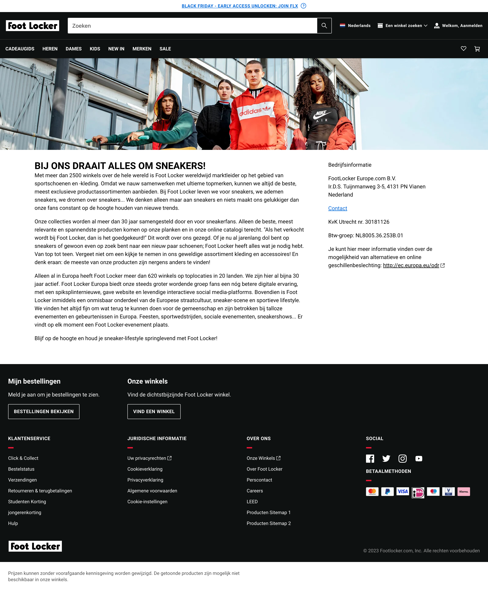

# Procesverslag
Markdown is een simpele manier om HTML te schrijven.  
Markdown cheat cheet: [Hulp bij het schrijven van Markdown](https://github.com/adam-p/markdown-here/wiki/Markdown-Cheatsheet).

Nb. De standaardstructuur en de spartaanse opmaak van de README.md zijn helemaal prima. Het gaat om de inhoud van je procesverslag. Besteedt de tijd voor pracht en praal aan je website.

Nb. Door *open* toe te voegen aan een *details* element kun je deze standaard open zetten. Fijn om dat steeds voor de relevante stuk(ken) te doen.

## Jij

  
uitwerken voor kick-off werkgroep

  ### Auteur:
  Tijn Gerhards

  #### Je startniveau:
  Rood
 
  #### Je focus:
  surface plane
 

## Je website

  
uitwerken voor kick-off werkgroep

  ### Je opdracht:
  link: https://www.footlocker.nl/nl?utm_source=google&utm_medium=cpc&utm_campaign=_1:nl_2:performance_3:google_4:do_5:search-pure-brand_6:conversion_7:mix_8:always+on_9:na_10:na&gad_source=1&gclid=Cj0KCQiAmNeqBhD4ARIsADsYfTf2ZmhLe5_12NOMznpqVDUXaQRY1yRE-4pmZiAthgnDlsVYY8MwwDwaAurNEALw_wcB&gclsrc=aw.ds

  #### Screenshot(s) van de eerste pagina (small screen): 
  hier de naam van de pagina  
  

  #### Screenshot(s) van de tweede pagina (small screen):
  hier de naam van de pagina  
  
 

## Toegankelijkheidstest 1/2 (week 1)

  
uitwerken na test in 2e werkgroep

  ### Bevindingen
  Lijst met je bevindingen die in de test naar voren kwamen: Waarnemingen

Hieronder vind je mijn bevindingen die naar voren kwamen tijdens de test. Individuen met visuele beperkingen, zoals blinden en slechtzienden, vertoonden diverse reacties. Sommigen kunnen bijvoorbeeld alleen op een beperkt gebied focussen, waardoor de rest van hun omgeving niet zichtbaar is. Op de website van Footlocker kan de drukte problematisch zijn voor slechtzienden, waardoor het moeilijk is om hun positie te bepalen te midden van de vele afbeeldingen en secties.

Hoewel ik zelf geen tests heb uitgevoerd voor personen met Parkinson/spasmes, heb ik dit waargenomen bij een medestudent. Hieruit kan worden geconcludeerd dat het vrijwel onmogelijk lijkt voor iemand met ernstige Parkinson om een website te gebruiken.

<strong>Screenreader</strong>

Een screenreader analyseert de HTML-structuur om blinden of slechtzienden in staat te stellen computers en smartphones gemakkelijker te gebruiken. Op de website van Footlocker wordt de screenreader goed benut, maar de site is druk en kan de gebruiker overweldigen met veel audio. Het kan tijdrovend zijn voor de gebruiker om naar het gewenste gedeelte van de website te navigeren. Hoewel ik het handig vond, waren er momenten waarop ik sneller naar een ander deel van de website wilde gaan, wat te lang duurde. Het zou nuttig zijn om het overslaan van bepaalde elementen toegankelijker te maken.

<strong>Muis en Toetsenbord</strong>

De Footlocker-website bevat veel content, wat betekent dat het moeilijk is om bij te houden waar je bent. Mensen met concentratieproblemen kunnen snel verdwalen en veel tijd besteden aan het achterhalen van hun positie. Footlocker heeft alleen standaardinstellingen wanneer je bijvoorbeeld tab gebruikt, waardoor het niet snel opvalt en nog langer kan duren.

<strong>Motoriek (schokken, elastiekjes)</strong>

Na mijn observaties bleek het voor gebruikers met spasmen onmogelijk om een telefoon of computer te gebruiken. Hoewel er weinig aan gedaan kan worden, kunnen gebruikers met Parkinson wel baat hebben bij grotere knoppen en goed ontworpen tabbladen en hun statussen om knoppen gemakkelijker te maken.

<strong>Visueel (brillen, contrast, kleurenblindheid, donker/licht)</strong>

Visuele beperkingen variëren; sommigen zien slechts een klein punt, anderen zijn kleurenblind of hebben zelfs een soort vlek in hun gezichtsveld. Het is belangrijk om breed te denken en rekening te houden met diverse behoeften. Tijdens de tests ondervond ik zelf de moeilijkheid om een deel van mijn zicht te verliezen, wat leidde tot concentratieverlies. Wanneer ik me kon concentreren, lukte het wel.

## Breakdownschets (week 1)

  
uitwerken na afloop 3e werkgroep

  ### de hele pagina: 
  

  ### dynamisch deel (bijv menu): 
  

  ### wellicht nog een dynamisch deel (bijv filter): 
  

## Voortgang 1 (week 2)

  
uitwerken voor 1e voortgang

  ### Stand van zaken
  hier dit ging goed & dit was lastig (neem ook screenshots op van delen van je website en code)

  ### Agenda voor meeting
  samen met je groepje opstellen

  | student 1      | student 2          | student 3    | student 4        |
  | ---            | ---                | ---          | ---              |
  | dit bespreken  | en dit             | en ik dit    | en dan ik dat    |
  | en dat ook nog | dit als er tijd is | nog een punt | dit wil ik zeker |
  | ...            | ...                | ...          | ...              |

  ### Verslag van meeting
  hier na afloop snel de uitkomsten van de meeting vastleggen

  - punt 1
  - punt 2
  - nog een punt
  - ...

## Voortgang 2 (week 3)

  
uitwerken voor 2e voortgang

  ### Stand van zaken
  hier dit ging goed & dit was lastig (neem ook screenshots op van delen van je website en code)

  ### Agenda voor meeting
  samen met je groepje opstellen

  | student 1      | student 2          | student 3    | student 4        |
  | ---            | ---                | ---          | ---              |
  | dit bespreken  | en dit             | en ik dit    | en dan ik dat    |
  | en dat ook nog | dit als er tijd is | nog een punt | dit wil ik zeker |
  | ...            | ...                | ...          | ...              |

  ### Verslag van meeting
  hier na afloop snel de uitkomsten van de meeting vastleggen

  - punt 1
  - punt 2
  - nog een punt
- ...

## Toegankelijkheidstest 2/2 (week 4)

  
uitwerken na test in 9e werkgroep

  ### Bevindingen
  Lijst met je bevindingen die in de test naar voren kwamen (geef ook aan wat er verbeterd is):

## Voortgang 3 (week 4)

  
uitwerken voor 3e voortgang

  ### Stand van zaken
  hier dit ging goed & dit was lastig (neem ook screenshots op van delen van je website en code)

  ### Agenda voor meeting
  samen met je groepje opstellen

  | student 1      | student 2          | student 3    | student 4        |
  | ---            | ---                | ---          | ---              |
  | dit bespreken  | en dit             | en ik dit    | en dan ik dat    |
  | en dat ook nog | dit als er tijd is | nog een punt | dit wil ik zeker |
  | ...            | ...                | ...          | ...              |

  ### Verslag van meeting
  hier na afloop snel de uitkomsten van de meeting vastleggen

  - punt 1
  - punt 2
  - nog een punt
  - ...

## Eindgesprek (week 5)

  
uitwerken voor eindgesprek

  ### Je uitkomst - karakteristiek screenshots:
  

  ### Dit ging goed/Heb ik geleerd: 
  Korte omschrijving met plaatjes

  

  ### Dit was lastig/Is niet gelukt:
  Korte omschrijving met plaatjes

  

## Bronnenlijst

  
continu bijhouden terwijl je werkt

  Nb. Wees specifiek ('css-tricks' als bron is bijv. niet specifiek genoeg). 
  Nb. ChatGpT en andere AI horen er ook bij.
  Nb. Vermeld de bronnen ook in je code.

  1. bron 1
  2. bron 2
  3. ...

