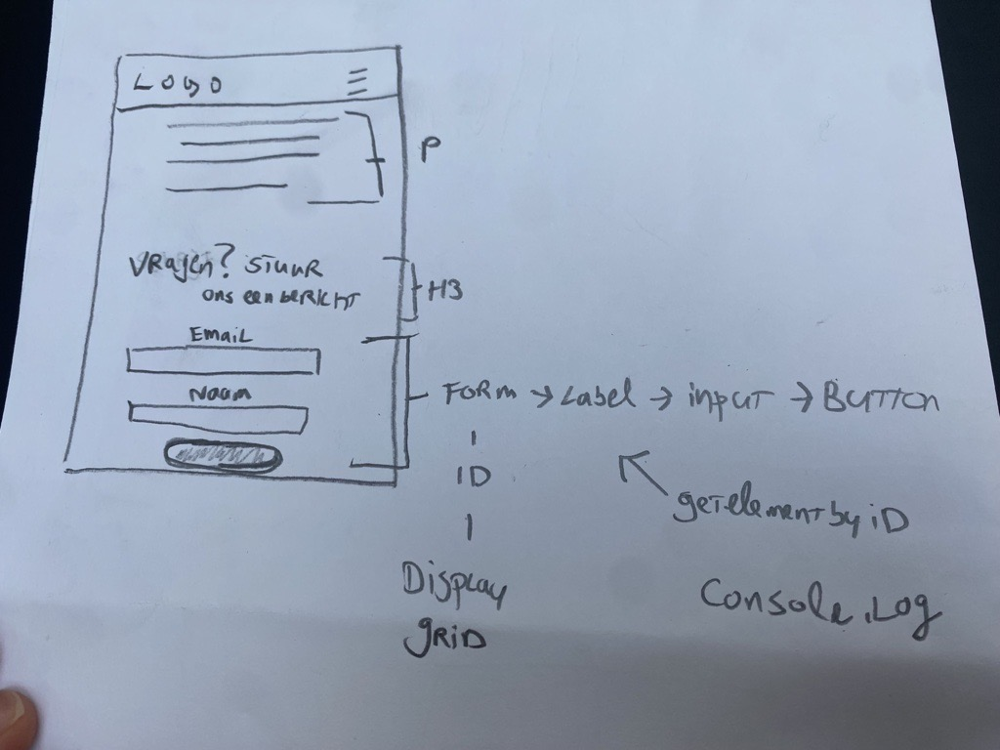

# Procesverslag
Markdown is een simpele manier om HTML te schrijven.  
Markdown cheat cheet: [Hulp bij het schrijven van Markdown](https://github.com/adam-p/markdown-here/wiki/Markdown-Cheatsheet).

Nb. De standaardstructuur en de spartaanse opmaak van de README.md zijn helemaal prima. Het gaat om de inhoud van je procesverslag. Besteedt de tijd voor pracht en praal aan je website.

Nb. Door *open* toe te voegen aan een *details* element kun je deze standaard open zetten. Fijn om dat steeds voor de relevante stuk(ken) te doen.

## Jij

  
uitwerken voor kick-off werkgroep

  ### Auteur:
  Tijn Gerhards

  #### Je startniveau:
  Rood
 
  #### Je focus:
  surface plane
 

## Je website

  
uitwerken voor kick-off werkgroep

  ### Je opdracht:
  link: https://www.footlocker.nl/nl?utm_source=google&utm_medium=cpc&utm_campaign=_1:nl_2:performance_3:google_4:do_5:search-pure-brand_6:conversion_7:mix_8:always+on_9:na_10:na&gad_source=1&gclid=Cj0KCQiAmNeqBhD4ARIsADsYfTf2ZmhLe5_12NOMznpqVDUXaQRY1yRE-4pmZiAthgnDlsVYY8MwwDwaAurNEALw_wcB&gclsrc=aw.ds

  #### Screenshot(s) van de eerste pagina (small screen): 
  Home pagina
  

  #### Screenshot(s) van de tweede pagina (small screen):
  Over ons pagina
  
 

## Toegankelijkheidstest 1/2 (week 1)

  
uitwerken na test in 2e werkgroep

  ### Bevindingen
  Lijst met je bevindingen die in de test naar voren kwamen: Waarnemingen

Hieronder vind je mijn bevindingen die naar voren kwamen tijdens de test. Individuen met visuele beperkingen, zoals blinden en slechtzienden, vertoonden diverse reacties. Sommigen kunnen bijvoorbeeld alleen op een beperkt gebied focussen, waardoor de rest van hun omgeving niet zichtbaar is. Op de website van Footlocker kan de drukte problematisch zijn voor slechtzienden, waardoor het moeilijk is om hun positie te bepalen te midden van de vele afbeeldingen en secties.

Hoewel ik zelf geen tests heb uitgevoerd voor personen met Parkinson/spasmes, heb ik dit waargenomen bij een medestudent. Hieruit kan worden geconcludeerd dat het vrijwel onmogelijk lijkt voor iemand met ernstige Parkinson om een website te gebruiken.

<strong>Screenreader</strong>

Een screenreader analyseert de HTML-structuur om blinden of slechtzienden in staat te stellen computers en smartphones gemakkelijker te gebruiken. Op de website van Footlocker wordt de screenreader goed benut, maar de site is druk en kan de gebruiker overweldigen met veel audio. Het kan tijdrovend zijn voor de gebruiker om naar het gewenste gedeelte van de website te navigeren. Hoewel ik het handig vond, waren er momenten waarop ik sneller naar een ander deel van de website wilde gaan, wat te lang duurde. Het zou nuttig zijn om het overslaan van bepaalde elementen toegankelijker te maken.

<strong>Muis en Toetsenbord</strong>

De Footlocker-website bevat veel content, wat betekent dat het moeilijk is om bij te houden waar je bent. Mensen met concentratieproblemen kunnen snel verdwalen en veel tijd besteden aan het achterhalen van hun positie. Footlocker heeft alleen standaardinstellingen wanneer je bijvoorbeeld tab gebruikt, waardoor het niet snel opvalt en nog langer kan duren.

<strong>Motoriek (schokken, elastiekjes)</strong>

Na mijn observaties bleek het voor gebruikers met spasmen onmogelijk om een telefoon of computer te gebruiken. Hoewel er weinig aan gedaan kan worden, kunnen gebruikers met Parkinson wel baat hebben bij grotere knoppen en goed ontworpen tabbladen en hun statussen om knoppen gemakkelijker te maken.

<strong>Visueel (brillen, contrast, kleurenblindheid, donker/licht)</strong>

Visuele beperkingen variëren; sommigen zien slechts een klein punt, anderen zijn kleurenblind of hebben zelfs een soort vlek in hun gezichtsveld. Het is belangrijk om breed te denken en rekening te houden met diverse behoeften. Tijdens de tests ondervond ik zelf de moeilijkheid om een deel van mijn zicht te verliezen, wat leidde tot concentratieverlies. Wanneer ik me kon concentreren, lukte het wel.

-----------------------------

Uit de bevindingen van de testresultaten met betrekking tot de website van Footlocker, zou ik de volgende vijf onderwerpen aanbevelen om de gebruikerservaring te verbeteren:

<strong> * Toegankelijkheid++: </strong>
    Gezien de diverse reacties van individuen met visuele beperkingen, is het implementeren van verbeteringen op het gebied van toegankelijkheid essentieel. Dit omvat het optimaliseren van de website voor screenreaders, het verminderen van auditieve overbelasting en het verbeteren van navigatiemogelijkheden.

<strong> * Formulieren toevoegen (op de 'Over ons' pagina):</strong>
    Het toevoegen van formulieren op specifieke pagina's, zoals de 'Over ons' pagina, vergroot de interactieve mogelijkheden voor gebruikers. Hiermee kunnen ze bijvoorbeeld vragen stellen, feedback geven of zich inschrijven voor nieuwsbrieven, waardoor de betrokkenheid wordt vergroot.

<strong> * Meer micro-interacties:</strong>
    Voeg subtiele micro-interacties toe op verschillende delen van de website om de algehele gebruikerservaring te verbeteren. Denk aan hover-effecten, animaties bij interacties en andere kleine details die de interactie met de website aangenamer maken.

<strong> * Werkend filteren/sorteren/zoeken:</strong>
    Om gebruikers met concentratieproblemen te ondersteunen, is het verbeteren van de filter-, sorteeropties en zoekfunctionaliteit belangrijk. Dit zorgt voor een efficiëntere navigatie door de inhoud van de website.

<strong> * Interactie met het toetsenbord++ (shortcuts, escape...):</strong>
    Voor gebruikers met motorische beperkingen is het implementeren van verbeteringen in de interactie met het toetsenbord cruciaal. Dit omvat het toevoegen van sneltoetsen, een duidelijke focusindicatie en een eenvoudige ontsnappingsmethode.

Deze aanpassingen richten zich op het vergroten van de toegankelijkheid, leesbaarheid, interactieve mogelijkheden, en de algehele gebruikerservaring van de website, waardoor deze beter aansluit bij de diverse behoeften van gebruikers.

## Breakdownschets (week 1)

  
uitwerken na afloop 3e werkgroep

  ### de hele pagina: 
  

  ### dynamisch deel (bijv menu): 
  

  ### wellicht nog een dynamisch deel (bijv filter): 
  

## Voortgang 1 (week 2)

  
uitwerken voor 1e voortgang

  ### Stand van zaken
  De overgang van het gebruik van uitsluitend div-elementen naar het gebruik van sections en articles, zonder veelvuldig gebruik van classes en ids, blijkt voor mij persoonlijk een uitdagende stap te zijn wanneer ik moet gaan beginnen met mijn code. Ik vind het ook lastig om aandacht te besteden aan de semantiek en zal hier meer informatie over opvragen. Bovendien ben ik geïnteresseerd in het verbeteren van de gebruikerservaring van de website en zou hier graag meer over willen weten.

  ### Agenda voor meeting

Mijn agenda uit de meeting is om antwoorden te krijgen op de vragen die ik heb omtrent mijn huidige breakdownschets:

* Wat verwacht je van de JavaScript-functionaliteit in het formulier bij indiening? Heb je suggesties voor verbeteringen?

* Welke essentiële aspecten moeten worden onderzocht voor de basisstructuur van het formulier? Heb je suggesties voor effectieve onderzoeksmethoden?

* Hoe goed is het concept van surface plane design begrepen en toegepast in de schetsen? Heb je suggesties ter verbetering?

* Wat vind je van het belang van het optimaliseren van de toetsenbordinteractie, vooral voor gebruikers met motorische beperkingen? Heb je specifieke suggesties voor sneltoetsen en focusindicaties?

* Heb je aanbevelingen voor bronnen om mijn begrip van het design te verbeteren en de succesvolle implementatie ervan in mijn schetsen te bevorderen?

* Wat is jullie mening over de haalbaarheid van mijn verwachtingen voor het hamburgermenu? Zijn er specifieke aandachtspunten? Link naar vraag op Stack Overflow

### Verslag van meeting
JavaScript-functionaliteit in het formulier bij indiening:
* Verwachtingen: De meerderheid van de feedbackgroep verwacht een naadloze en intuïtieve JavaScript-functionaliteit bij het indienen van het formulier. Ze benadrukken de noodzaak van een heldere console-uitvoer voor een betere gebruikerservaring.
* Suggesties: Enkele suggesties voor verbetering omvatten het overwegen van visuele feedback na het indienen en het implementeren van client-side validatie om fouten proactief aan te pakken.

Essentiële aspecten en onderzoeksmethoden voor de formulierstructuur:
* Essentiële aspecten: De feedbackgroep benadrukt het belang van een duidelijke en intuïtieve structuur, met speciale aandacht voor het verbeteren van de gebruikerservaring op de 'Over ons' pagina.
* Onderzoeksmethoden: Aanbevelingen voor effectieve onderzoeksmethoden omvatten het bestuderen van best practices op vergelijkbare websites, het raadplegen van bronnen zoals MDN Web Docs en het uitvoeren van gebruikerstests met diverse gebruikersgroepen.

Concept van Surface Plane Design in de schetsen:
* Begrip en toepassing: Over het algemeen wordt het concept van Surface Plane Design positief ontvangen. De groep merkt op dat de schetsen aandacht besteden aan verbeteringen in toegankelijkheid, leesbaarheid en interactieve mogelijkheden.
* Verbetersuggesties: Enkele suggesties voor verbetering zijn het verkennen van meer micro-interacties en het toevoegen van subtiele details om de algehele gebruikerservaring te verrijken.

Optimaliseren van toetsenbordinteractie voor gebruikers met motorische beperkingen:
* Belang van optimalisatie: De feedbackgroep erkent het belang van het optimaliseren van toetsenbordinteractie, met speciale aandacht voor gebruikers met motorische beperkingen. Duidelijke focusindicaties en sneltoetsen worden als cruciaal beschouwd.
* Suggesties: Enkele suggesties zijn het implementeren van duidelijke visuele aanwijzingen bij het navigeren met het toetsenbord en het toevoegen van aanpasbare sneltoetsen voor specifieke functies.

Aanbevelingen voor bronnen ter verbetering van designbegrip en implementatie:
* Aanbevelingen: De groep deelt verschillende aanbevelingen voor bronnen, waaronder artikelen op A List Apart, tutorials op CSS Tricks en casestudy's op bekende designwebsites.
* Breder perspectief: Er wordt aangeraden om bronnen van diverse platforms te verkennen voor een breder perspectief op designprincipes en implementatietechnieken.

Haalbaarheid van verwachtingen voor het hamburgermenu:
* Algemeen oordeel: De haalbaarheid van de verwachtingen voor het hamburgermenu wordt als realistisch beschouwd door de meerderheid van de feedbackgroep.
* Aandachtspunten: Sommige leden wijzen op mogelijke uitdagingen met betrekking tot CSS en JavaScript-integratie. Ze raden aan om specifieke details van de implementatie in de schetsen op te nemen voor een beter begrip.

Conclusie:
De feedbacksessie heeft waardevolle inzichten opgeleverd om de schetsen te verfijnen en te verbeteren. De aanbevelingen variëren van technische verbeteringen tot bredere designoverwegingen, en ze zullen dienen als waardevolle richtlijnen voor verdere ontwikkeling en iteratie. Het is essentieel om de aangeboden suggesties zorgvuldig te overwegen en ze te integreren in het verdere ontwerpproces.

## Voortgang 2 (week 3)

  
uitwerken voor 2e voortgang

  ### Stand van zaken
  
<strong>Navigatie:</strong> Op dit moment is de navigatie nog niet geïmplementeerd op de website. Het ontbreekt aan een gestructureerde en gebruiksvriendelijke manier om door de verschillende secties of pagina's te navigeren.
<strong>Heading Structuur:</strong> Er wordt opgemerkt dat er nog meerdere h1-tags worden gebruikt in de content. Het is van belang om de opbouw van de pagina te verbeteren door verschillende heading niveaus te benutten. Dit draagt bij aan een betere leesbaarheid en begrijpelijkheid van de inhoud.
<strong>Zelfstandigheid:</strong> Momenteel is er een neiging om veel hulp te vragen aan anderen in plaats van zelfstandig op zoek te gaan naar oplossingen. De focus moet verschuiven naar meer zelfstandigheid en het nemen van initiatief bij het oplossen van problemen en het implementeren van verbeteringen. Dit bevordert niet alleen de individuele groei, maar ook de efficiëntie van het ontwikkelingsproces.

  ### Agenda voor meeting
 
In de aankomende vergadering wil ik me richten op een cruciaal doel: het verbeteren van mijn website in termen van navigatie en heading-structuur, en het bevorderen van zelfstandigheid binnen mijn ontwikkelingsproces.

Als ik naar de huidige stand van zaken kijk, merk ik op dat er nog steeds een gebrek is aan een gestructureerde en gebruiksvriendelijke navigatie op mijn website. Dit vormt een obstakel voor bezoekers om vlot door verschillende secties en pagina's te navigeren. Mijn aanpak is om concrete stappen te bespreken die de gebruikerservaring aanzienlijk zullen versterken.

Een ander aandachtspunt betreft de opbouw van mijn pagina's. Ik heb opgemerkt dat er meerdere h1-tags worden gebruikt in de content, wat de leesbaarheid en begrijpelijkheid beïnvloedt. Mijn plan is een doordachte herziening van de heading-structuur met verschillende niveaus voor een meer gestroomlijnde presentatie van informatie. Hierdoor kunnen bezoekers de inhoud gemakkelijker begrijpen.

Ik ben toegewijd aan het nemen van initiatief en het zelfstandig oplossen van deze kwesties om de efficiëntie van mijn ontwikkelingsproces te verbeteren.

  

  ### Verslag van meeting
  hier na afloop snel de uitkomsten van de meeting vastleggen

Het doet me goed te vernemen dat mijn inspanningen zijn opgemerkt en gewaardeerd. Het positieve feedback ontvangen heeft mijn motivatie versterkt en mij aangemoedigd om op de ingeslagen weg door te gaan. Na het horen van deze bemoedigende woorden heb ik mijn focus en toewijding aan mijn werk zeker gehandhaafd.

## Toegankelijkheidstest 2/2 (week 4)

  
uitwerken na test in 9e werkgroep

  ### Bevindingen
  
<strong>Screenreader</strong>
  
De screenreader-functie functioneert naar behoren op de website van Footlocker. Je krijgt duidelijke feedback over op welk specifiek punt je je bevindt, met veel alternatieve teksten om verwarring te voorkomen. Ik heb deze aanpak ook geïntegreerd in mijn eigen website, waardoor het net zo effectief werkt als op de Footlocker-website.

Echter, op de site van Footlocker wordt er overmatig gebruik gemaakt van div-elementen, wat kan leiden tot onlogisch lezen. Een mogelijke oplossing is om, wanneer er geen interesse is in bepaalde elementen maar je er toch doorheen moet navigeren, ervoor te zorgen dat onrelevante of minder belangrijke onderdelen worden overgeslagen.

Ik neem deze ervaringen mee naar mijn eigen website. Ik plan om mijn site te optimaliseren door correcte semantische waarden toe te passen, met speciale aandacht voor het juiste gebruik van sections en articles, evenals het correct inzetten van h1/h2/h3 en het toevoegen van verduidelijkend commentaar. Dit is vooral belangrijk voor screenreaders, omdat ze deze semantische structuren correct kunnen interpreteren in tegenstelling tot eenvoudige div-elementen.

Daarnaast zal ik de tabfunctie op mijn website verbeteren door extra nadruk te leggen, bijvoorbeeld door een extra dikke border toe te voegen aan het element dat momenteel geselecteerd is via de tabfunctie. Bovendien zal ik ervoor zorgen dat tabben door de navigatiebalk op desktopmodus soepel verloopt, waardoor de gebruikerservaring wordt verbeterd.  
  
<strong>Muizen en Toetsenborden</strong>

Het gebruik van muizen en toetsenborden varieert sterk afhankelijk van de beperking. Bijvoorbeeld, als je slechtziend bent of kleurenblind, kun je nog steeds een formulier invullen of door de site navigeren. Echter, bij een motorieke beperking blijft dit vaak uitdagend. Ik heb mezelf voorgenomen om meer nadruk te leggen op het tabbladen door mijn site, zodat de gebruiker tenminste duidelijk kan zien waar hij/zij zich bevindt.

<strong>Motoriek (shocks, elastiekjes)</strong>

Bij deze test heb ik elastiekjes gebruikt op zowel mobiel als desktop. Hieruit bleek dat het gebruik ervan moeilijker is met een trackpad. Trackpads maken gebruik van shortcuts met meerdere vingers, bijvoorbeeld met twee vingers kun je scrollen. Het kwam vaak voor dat ik conflicten had met de trackpad. Op mobiel was het gebruik daarentegen prettig en werkte alles naar behoren.

<strong>Visueel (brillen, contrast, kleurenblind, dark/light)</strong>

Door het gebruik van brillen kwam ik tegen hetzelfde probleem aan als bij Footlocker. Tekstlinkjes en klikbare afbeeldingen moeten nog duidelijker zijn in de huidige staat. Er moet nog aan gewerkt worden om dit te verbeteren.

## Voortgang 3 (week 4)

  
uitwerken voor 3e voortgang

  ### Stand van zaken
  hier dit ging goed & dit was lastig (neem ook screenshots op van delen van je website en code)

  ### Agenda voor meeting
  samen met je groepje opstellen VRAGEN:

- footer
- verbetering navbar hamburger menu

De vragen die ik had, heb ik zelf kunnen oplossen door even weer flexbox froggy te gaan doen omdat ik vastliep bij het maken van de footer. https://flexboxfroggy.com/#nl

  ### Verslag van meeting
  hier na afloop snel de uitkomsten van de meeting vastleggen:
  
Ik heb voortgebouwd op specifieke toestanden om de focus te leggen op gebruikers die tab gebruiken en afhankelijk zijn van knopstaten. Daarnaast heb ik vooruitgang geboekt richting het uiteindelijke resultaat.

## Eindgesprek (week 5)

  
uitwerken voor eindgesprek

  ### Je uitkomst - karakteristiek screenshots:
  

  ### Dit ging goed/Heb ik geleerd: 
  Korte omschrijving met plaatjes

  

  ### Dit was lastig/Is niet gelukt:
  Korte omschrijving met plaatjes

  

## Bronnenlijst

  
continu bijhouden terwijl je werkt

  Nb. Wees specifiek ('css-tricks' als bron is bijv. niet specifiek genoeg). 
  Nb. ChatGpT en andere AI horen er ook bij.
  Nb. Vermeld de bronnen ook in je code.

  1. bron 1
  2. bron 2
  3. ...

